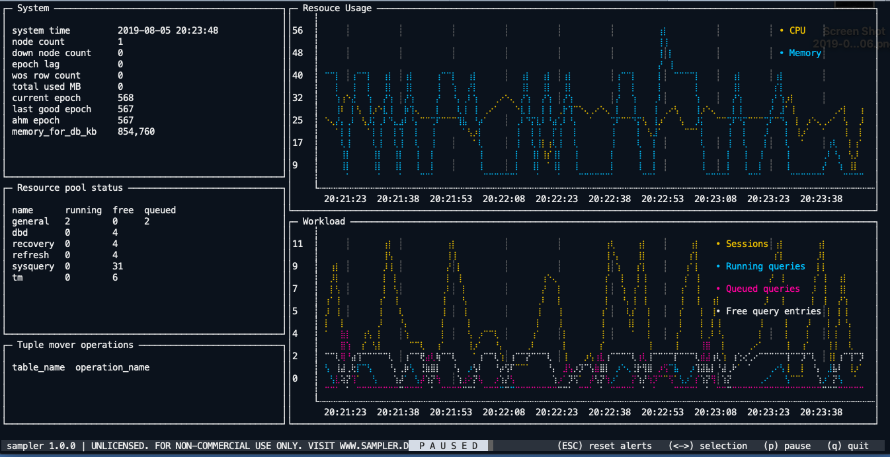

# Vertica Terminal Quick Monitoring Tool

This project integrates **[sqshq/sampler](https://github.com/sqshq/sampler)** to show monitoring measures from Vertica database in terminal.

It's tested on CentOS 7.4 and macOS Mojave 10.14.6 .

- Screenshots:



- Usages:

```bash
$ ./quickmon.sh -h
Usage: quickmon.sh [options]
Options:
    -n interval
       Specify update interval seconds, only positive integer accepted.
    -h show this usage info.

Prerequisites:
1. Please set VSQL environment parameter before run this tool, eg. export VSQL='/opt/vertica/bin/vsql [-h verticaHost] [-u username] [-w password] [databaseName]'
2. Install util "column", eg. run "yum install util-linux" on CentOS/RHEL
```

